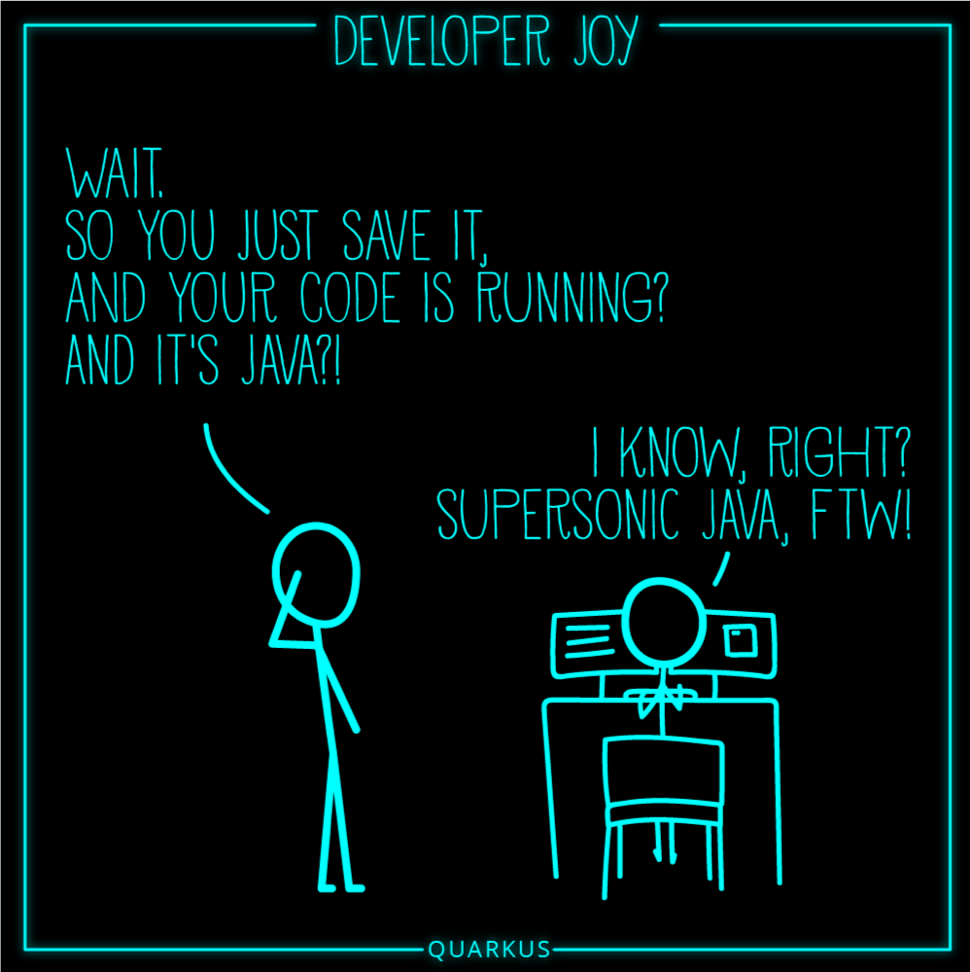
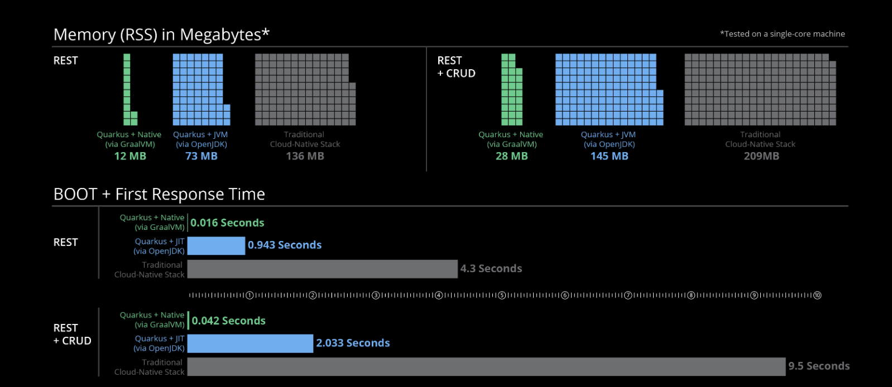

## Build Status

# Currency Converter 

É uma API que fornece a conversão entre as principais moedas do mercado mundial. As taxas de conversão são obtidas através da plataforma [https://exchangeratesapi.io/](https://exchangeratesapi.io/), que conta com mais de 15 fontes de taxas
de câmbio e está entregando dados para mais de 170 moedas mundiais.

## Como utilizar a API

Em construção

## Recursos utilizados no projeto

A API foi desenvolvida utilizando a linguagem [JAVA 11](https://docs.oracle.com/en/java/javase/11/) com o framework [Quarkus](https://quarkus.io)

  </img>

### Porque usar o Quarkus?

O Quarkus é um framework java open source desenvolvido pela Red Hat e lançado no final de 2018. Foi desenvolvido sob medida para o GraalVM e OpenJDK HotSpot, com a promessa de ter um startup muito rápido e pouco gasto de memória de
footprint, sendo assim um framework ótimo para cloud (ex: k8s), microservices e também serverless.

  </img>

Na imagem acima, extraída do site [https://www.openshift.com/blog/quarkus-is-here-for-your-java](https://www.openshift.com/blog/quarkus-is-here-for-your-java), é possível ver dados de tempo de inicialização e consumo de memória com um
executável nativo ou utilizando a JDK.

### Bibliotecas utilizadas

- [**Maven**](https://maven.apache.org/): Build e Controle de dependências
- [**H2 Database**](https://www.h2database.com): Banco de dados emdbedded
- [**Hibernate ORM com Panache**](https://quarkus.io/guides/hibernate-orm-panache): Simplificar a camada de persistência
- [**Flyway**](https://flywaydb.org): Controle de versão do banco de dados
- [**SmallRye Health**](https://github.com/smallrye/smallrye-health): Monitorar a saúde da aplicação
- [**JUnit 5**](https://junit.org/junit5/): Implementação de casos de testes

## Lint e Cobertura de Testes

- [**SonarLint**](https://www.sonarlint.org/intellij): Integrado a IDE Intellij
- [**JaCoCo**](https://github.com/jacoco/jacoco): Cobertura de testes
- [**SonarCloud**](https://sonarcloud.io): Melhorar a qualidade e segurança do código

## CI/CD

Em contrução
