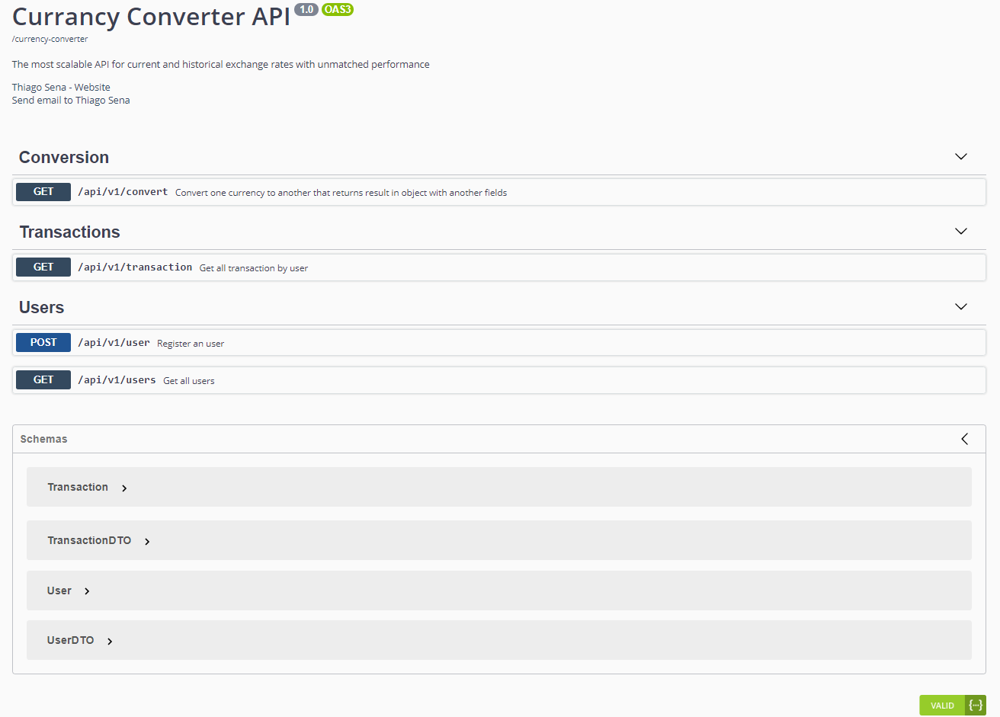
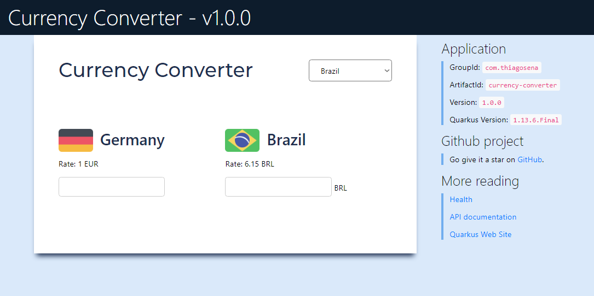
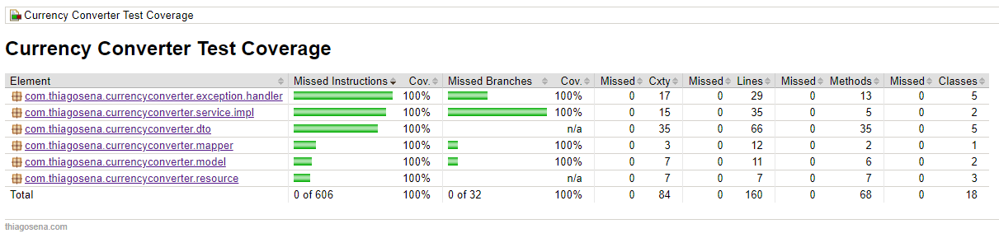
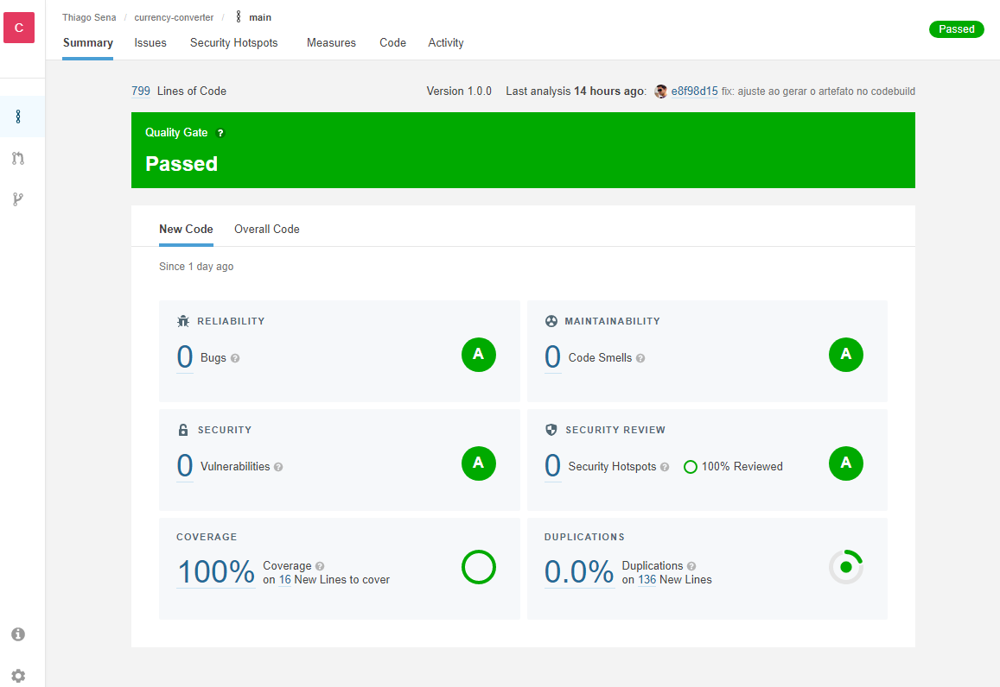
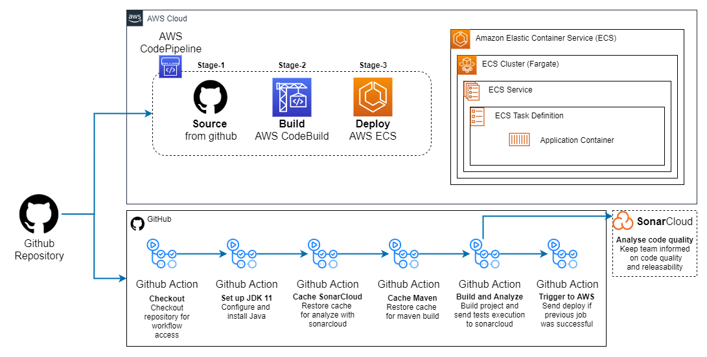

## Build Status

<div align="center">

[](https://sonarcloud.io/dashboard?id=thiagosena_currency-converter)
[](https://sonarcloud.io/dashboard?id=thiagosena_currency-converter)
[](https://sonarcloud.io/dashboard?id=thiagosena_currency-converter)
[](https://sonarcloud.io/dashboard?id=thiagosena_currency-converter)
</div>

# Currency Converter [](https://github.com/thiagosena/currency-converter/releases/latest)

É uma API que fornece a conversão entre as principais moedas do mercado mundial. As taxas de conversão são obtidas através da plataforma [https://exchangeratesapi.io/](https://exchangeratesapi.io/), que conta com mais de 15 fontes de taxas
de câmbio e está entregando dados para mais de 170 moedas mundiais.

## Executando o projeto local
### Pré Requisitos:
- Git
- JDK 11
- Apache Maven

```shell
git clone git@github.com:thiagosena/currency-converter.git
cd currency-converter
mvn compile quarkus:dev
```
Após a compilação do projeto, basta acessar o endereço [http://localhost:8080](http://localhost:8080)

## Como utilizar a API

A API possui 4 endpoints:

<table>
    <tr>
        <th>
            Método
        </th>
        <th>
            Endpoint
        </th>
        <th>
            Descrição
        </th>
        <th>
            Exemplo
        </th>
    </tr>
    <tr>
        <td>
            GET
        </td>
        <td>
            /api/v1/convert
        </td>
        <td>
            Faz a conversão de uma moeda pra outra
        </td>
        <td>
<pre>
curl -X 'GET' \
  'https://currencyconverterapi.thiagosena.com/api/v1/convert?source=EUR&target=BRL&user_id=1&value=5' \
  -H 'accept: application/json'
</pre>
Retorno:
<pre>
{
  "conversionRate": 6.13362,
  "dateTime": "2021-06-14T17:53:54.449717",
  "id": 1,
  "sourceCurrency": "EUR",
  "sourceValue": 5,
  "targetCurrency": "BRL",
  "targetValue": 30.6681,
  "userId": 1
}
</pre>
        </td>
    </tr>
    <tr>
        <td>
            GET
        </td>
        <td>
            /api/v1/transactions
        </td>
        <td>
            Lista todas as transações efetuadas por um usuário
        </td>
        <td>
            <pre>
curl -X 'GET' \
  'https://currencyconverterapi.thiagosena.com/api/v1/transaction?user_id=1' \
  -H 'accept: application/json'
</pre>
Retorno:
<pre>
[
  {
    "conversionRate": 6.193318,
    "dateTime": "2021-06-14T04:09:22.657742",
    "id": 1,
    "sourceCurrency": "EUR",
    "sourceValue": 1,
    "targetCurrency": "BRL",
    "userId": 1
  }
]
</pre>
        </td>
    </tr>
    <tr>
        <td>
            POST
        </td>
        <td>
            /api/v1/user
        </td>
        <td>
            Efetua o cadastro de um usuário
        </td>
        <td>
            <pre>
curl -X 'POST' \
  'https://currencyconverterapi.thiagosena.com/api/v1/user' \
  -H 'accept: */*' \
  -H 'Content-Type: application/json' \
  -d '{
  "name": "Felipe"
}'
</pre>
Retorno:
<pre>
{
  "id": 3,
  "name": "Felipe"
}
</pre>
        </td>
    </tr>
    <tr>
        <td>
            GET
        </td>
        <td>
            /api/v1/users
        </td>
        <td>
            Lista todos os usuários
        </td>
        <td>
            <pre>
curl -X 'GET' \
  'https://currencyconverterapi.thiagosena.com/api/v1/users' \
  -H 'accept: application/json'
</pre>
Retorno:
<pre>
[
  {
    "id": 1,
    "name": "Joao"
  },
  {
    "id": 2,
    "name": "Acheropita Nagazaki"
  }
]
</pre>
        </td>
    </tr>
</table>

Para visualizar a documentação completa da API, basta acessar o endereço [https://currencyconverterapi.thiagosena.com/swagger-ui/](https://currencyconverterapi.thiagosena.com/swagger-ui/)

<p align="center">
  </img>
</p>

Foi implementado também um protótipo de interface simples utilizando o framework Vue.js com algumas bibliotecas. Para visualizar o exemplo basta acessar o
endereço [https://currencyconverterapi.thiagosena.com](https://currencyconverterapi.thiagosena.com).

<p align="center">
  </img>
</p>

## Recursos utilizados no projeto

A API foi desenvolvida utilizando a linguagem [JAVA 11](https://docs.oracle.com/en/java/javase/11/) e o framework [Quarkus](https://quarkus.io)

<p align="center">
  </img>
</p>

### Porque usar o Quarkus?

O Quarkus é um framework java open source desenvolvido pela Red Hat e lançado no final de 2018. Foi desenvolvido sob medida para o GraalVM e OpenJDK HotSpot, com a promessa de ter um startup muito rápido e pouco gasto de memória de
footprint, sendo assim um framework ótimo para cloud (ex: k8s), microservices e também serverless.

<p align="center">
  </img>
</p>

Na imagem acima, extraída do site [https://www.openshift.com/blog/quarkus-is-here-for-your-java](https://www.openshift.com/blog/quarkus-is-here-for-your-java), é possível ver dados de tempo de inicialização e consumo de memória com um
executável nativo ou utilizando a JDK.

### Bibliotecas utilizadas

- [**Maven**](https://maven.apache.org/): Build e Controle de dependências
- [**H2 Database**](https://www.h2database.com): Banco de dados emdbedded
- [**Hibernate ORM com Panache**](https://quarkus.io/guides/hibernate-orm-panache): Simplificar a camada de persistência
- [**Flyway**](https://flywaydb.org): Controle de versão do banco de dados
- [**SmallRye Health**](https://github.com/smallrye/smallrye-health): Monitorar a saúde da aplicação
- [**JUnit 5**](https://junit.org/junit5/): Implementação de casos de testes

## Lint e Cobertura de Testes

- [**SonarLint**](https://www.sonarlint.org/intellij): Integrado a IDE Intellij
- [**JaCoCo**](https://github.com/jacoco/jacoco): Cobertura de testes

<p align="center">
  </img>
</p>

- [**SonarCloud**](https://sonarcloud.io): Melhorar a qualidade e segurança do código.

<p align="center">
  </img>
</p>

## CI/CD

O processo de execução dos testes estão sendo realizados no github action com o sonarcloud. O code deploy foi implementado utilizando a infraestrutura da AWS. Para isso, se a build, junto com os testes e o sonarcloud forem executados com
sucesso, o github action envia um trigger para o AWS Pipeline fazer a execução do deploy como ilustrado na imagem abaixo.

<p align="center">
  </img>
</p>
